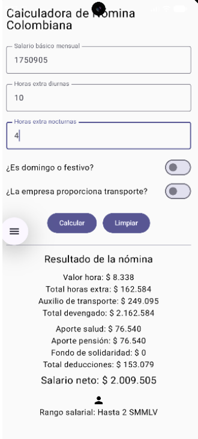
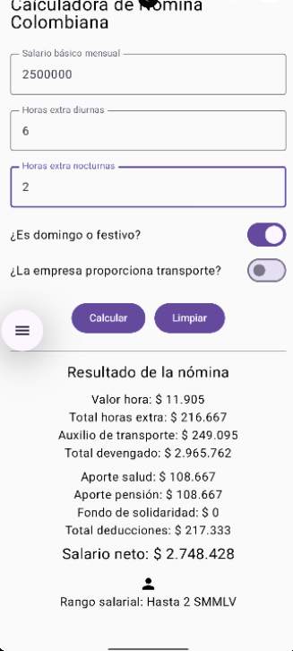
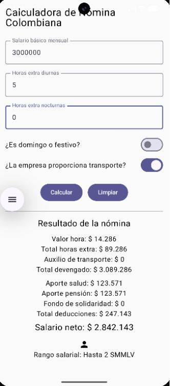
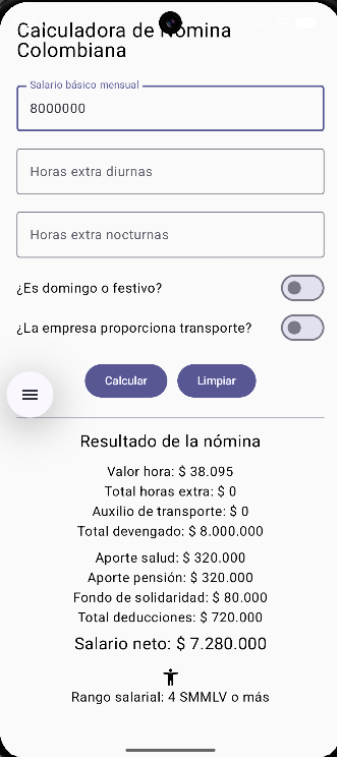
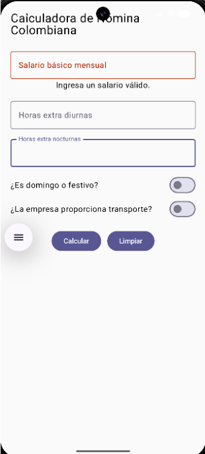

# Calculadora de Nómina Colombiana

## Información del estudiante

**Nombre:** Zara Meza Clavijo  
**Código:** 56763

## Descripción

Aplicación móvil desarrollada con Kotlin y Jetpack Compose para calcular la nómina mensual de un trabajador en Colombia.

La aplicación permite ingresar el salario básico mensual, las horas extra diurnas y nocturnas, indicar si las horas extra corresponden a un domingo o festivo y especificar si la empresa proporciona transporte.

A partir de estos datos, la aplicación calcula el valor de la hora ordinaria, el pago de horas extra, el auxilio de transporte, el total devengado, los aportes a salud y pensión, el Fondo de Solidaridad Pensional, el total de deducciones y el salario neto.

También clasifica el salario según el número de SMMLV y muestra una imagen correspondiente al rango salarial.

## Tecnologías utilizadas

- Kotlin
- Jetpack Compose
- Android Studio
- Material 3
- Git
- GitHub

## Funcionalidades

- Ingreso del salario básico mensual.
- Ingreso de horas extra diurnas.
- Ingreso de horas extra nocturnas.
- Cálculo de horas extra en días hábiles.
- Cálculo de horas extra en domingos o festivos.
- Cálculo del auxilio de transporte.
- Cálculo de aportes a salud y pensión.
- Cálculo del Fondo de Solidaridad Pensional.
- Cálculo del salario neto.
- Clasificación del salario por rango de SMMLV.
- Validación del salario mínimo.
- Validación de horas extra.
- Límite de 48 horas extra.
- Botón para limpiar los datos.
- Formato de valores en pesos colombianos.
- Interfaz desplazable verticalmente.

## Casos de verificación

### Caso A — Salario mínimo con horas extra en día hábil

**Entradas:**

- Salario: $1.750.905
- Horas extra diurnas: 10
- Horas extra nocturnas: 4
- Domingo o festivo: No
- Transporte de la empresa: No

**Resultados:**

- Valor hora ordinaria: $8.338
- Horas extra: $162.584
- Auxilio de transporte: $249.095
- Total devengado: $2.162.584
- Salud: $76.540
- Pensión: $76.540
- Fondo de Solidaridad: $0
- Salario neto: $2.009.505
- Rango: Rango 1



### Caso B — Horas extra en domingo o festivo

**Entradas:**

- Salario: $2.500.000
- Horas extra diurnas: 6
- Horas extra nocturnas: 2
- Domingo o festivo: Sí
- Transporte de la empresa: No

**Resultados:**

- Valor hora ordinaria: $11.905
- Horas extra: $216.667
- Auxilio de transporte: $249.095
- Total devengado: $2.965.762
- Salud: $108.667
- Pensión: $108.667
- Fondo de Solidaridad: $0
- Salario neto: $2.748.428
- Rango: Rango 1



### Caso C — Transporte suministrado por la empresa

**Entradas:**

- Salario: $3.000.000
- Horas extra diurnas: 5
- Horas extra nocturnas: 0
- Domingo o festivo: No
- Transporte de la empresa: Sí

**Resultados:**

- Valor hora ordinaria: $14.286
- Horas extra: $89.286
- Auxilio de transporte: $0
- Total devengado: $3.089.286
- Salud: $123.571
- Pensión: $123.571
- Fondo de Solidaridad: $0
- Salario neto: $2.842.143
- Rango: Rango 1



### Caso D — Salario alto con Fondo de Solidaridad Pensional

**Entradas:**

- Salario: $8.000.000
- Horas extra diurnas: 0
- Horas extra nocturnas: 0
- Domingo o festivo: No
- Transporte de la empresa: No

**Resultados:**

- Valor hora ordinaria: $38.095
- Horas extra: $0
- Auxilio de transporte: $0
- Total devengado: $8.000.000
- Salud: $320.000
- Pensión: $320.000
- Fondo de Solidaridad: $80.000
- Salario neto: $7.280.000
- Rango: Rango 3



## Validaciones

La aplicación valida:

- Salario vacío.
- Salario inferior al SMMLV.
- Horas extra inválidas o negativas.
- Más de 48 horas extra.

### Evidencia de validación



## Evidencias de la Parte 1

Las evidencias de los codelabs Dice Roller y Tip Time se encuentran en la carpeta `evidencias/`.

- Dice Roller
- Tip Time

## Estructura del proyecto

```text
CalculadoraNomina/
├── app/
├── gradle/
├── evidencias/
├── .gitignore
├── build.gradle.kts
├── gradle.properties
├── gradlew
├── gradlew.bat
├── README.md
└── settings.gradle.kts
